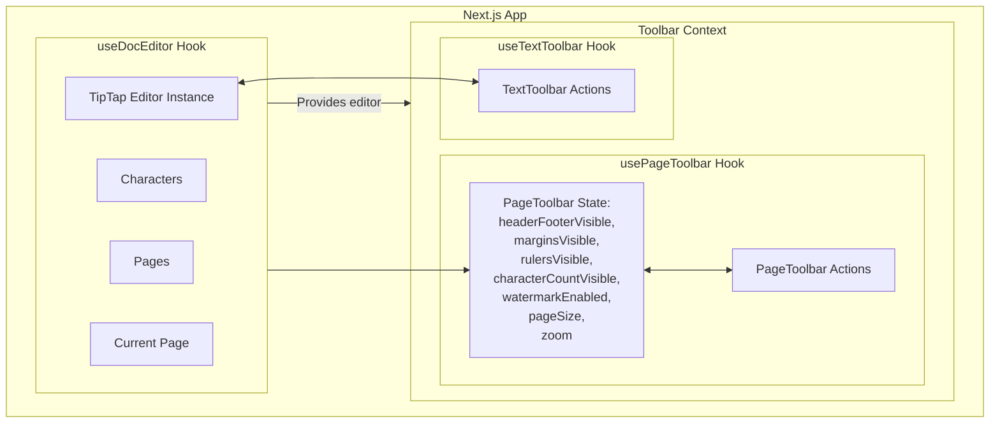

# 📄 Tiptap Pagination Editor Prototype

This is a prototype rich text editor built using **Tiptap** and **React**, designed to mimic traditional paginated document editing like in Word or Google Docs with a focus on features useful to legal professionals.

The editor supports:

- Visual page boundaries (A4 format)
- Manual page breaks
- Per-page headers and footers (static)
- Watermarks
- Margin editing via draggable rulers
- Character count

---

## 🛠️ Tech Stack

- **Framework**: Next.js (React)
- **Editor**: Tiptap (ProseMirror-based)
- **Styling**: Tailwind CSS
- **State Management**: React Context + hooks (no external libraries)

---
## 🎥 Demo Video
Here's a quick look at the editor in action:
[Watch the demo video here](https://github.com/user-attachments/assets/70343e84-701e-42fd-bef4-dbd2e13a2b28)

## Features Implemented

### 📑 Pagination

- **PageBlock Node**: Created to replicate individual A4-sized pages.
- **Manual Page Breaks**: Users can insert page breaks to split content manually.
- **Visual Boundaries**: Clearly marked A4 page layout.
- **Page Size Options**: Supports dynamic resizing to A4, Letter, and Legal formats.

### 🧾 Header & Footer

- **Header/Footer Nodes**: Static content added per page.
- **Insertion/Deletion**: Users can add or remove headers and footers.
- **Page Number Rendering**: Dynamically displayed per page.
- _Note_: Text synchronization across pages not yet implemented.

### 💧 Watermark

- **Watermark Node**: Default text `"WATERMARK"` rendered across all pages.
- **Insertion/Deletion**: Fully supported.
- _Note_: Text editing and synchronization not implemented.

### 📏 Margins & Rulers

- **Draggable Rulers**: Visually adjust margins per page.
- **Margin Add/Remove**: Functionality in place to toggle or adjust.

### 🔠 Character Count

- Dynamic character count synced with the editor state.

### 💅 UI & UX

- **Atomic Design Approach**: Component structure follows atomic principles for scalability and reuse.
- **Tab Interface**: Page and Text views are separated using tabs, with shared state via context.

---

## ⚠️ Known Limitations

- **Automatic Page Breaks**: Not implemented due to complexity and edge cases (e.g., nested nodes, partial splits).
- **Header/Footer Text Sync**: Static across pages; no dynamic synchronization.
- **Watermark Editing**: Default only no in-editor text customization yet.

---

## High Level Architecture


## 📦 How to Run Locally

```bash
git clone [<your-repo-url>](https://github.com/muraliSingh7/vettam_ai_assignment.git)
cd tiptap-pagination-editor
npm install
npm run dev
```

Open [http://localhost:3000](http://localhost:3000) in your browser.

---

## 🚀 If Productionizing

If this prototype were to be developed for production use:

- Auto Pagination: Add smart layout handling for content overflow.
- Editable & Synced Header/Footer: Templates editable globally across pages.
- Rich Print & Export Support: Improve PDF export fidelity with tools like Puppeteer or server-side renderers.
- Collaborative Editing: Use a real-time backend (e.g. WebSocket + Node.js + PostgreSQL or Redis pub/sub). Avoid browser-only tools like Firebase or Supabase.
- Access Control & Templates: Include user roles, legal document templates, and audit trail support.

---

## 🧠 Design Choices & Trade-Offs

- **Manual over automatic**: Skipped auto-pagination for now due to the complexity of DOM-based height calculations and content fragmentation.
- **No external state libraries**: Kept things minimal with React Context to maintain simplicity.
- **Visual-first**: Prioritized rendering fidelity and editor visuals, with page boundaries, rulers, and layout fidelity over full document logic.

---

## 📬 Feedback & Contributions

This is a prototype and still evolving. Suggestions, issues, or feedback are always welcome.

---
